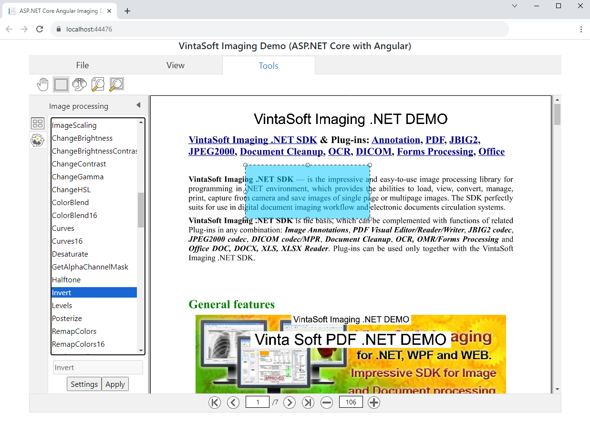

# VintaSoft ASP.NET Core Angular Imaging Demo

This ASP.NET Core with Angular project uses <a href="https://www.vintasoft.com/vsimaging-dotnet-index.html">VintaSoft Imaging .NET SDK</a>.
The client-side of project is written on Angular (TypeScript+HTML+CSS). The server-side of project uses ASP.NET Core API controllers.<br />
<br />
The project demonstrates how to view and process images in ASP.NET Core with Angular:
* Open image file.
* View images in image viewer with ability to zoom and magnify image. Also image viewer can rotate an image display. Set up settings of image viewer.
* View image thumbnails in thumbnail viewer. Set up settings of thumbnail viewer.
* Apply 110+ image processing commands to the whole image or image region. Set up settings of image processing command.
* Print processed image.
* Download processed image.
* The application can be used in any modern HTML5 web browser.


## Screenshot
<br />


## Usage
1. Get the 30 day free evaluation license for <a href="https://www.vintasoft.com/vsimaging-dotnet-index.html" target="_blank">VintaSoft Imaging .NET SDK</a> as described here: <a href="https://www.vintasoft.com/docs/vsimaging-dotnet/Licensing-Evaluation.html" target="_blank">https://www.vintasoft.com/docs/vsimaging-dotnet/Licensing-Evaluation.html</a>

2. Update the evaluation license in "src\Program.cs" file:
   ```
   Vintasoft.Imaging.ImagingGlobalSettings.Register("REG_USER", "REG_EMAIL", "EXPIRATION_DATE", "REG_CODE");
   ```

3. Build the project ("AspNetCoreAngularImagingDemo.Net7.csproj" file) in Visual Studio or using .NET CLI:
   ```
   dotnet build AspNetCoreAngularImagingDemo.Net7.csproj
   ```

4. Run compiled application and try to view and annotate images and documents.


## Documentation
VintaSoft Imaging .NET SDK on-line User Guide and API Reference for Web developer is available here: https://www.vintasoft.com/docs/vsimaging-dotnet-web/


## Support
Please visit our <a href="https://myaccount.vintasoft.com/">online support center</a> if you have any question or problem.
